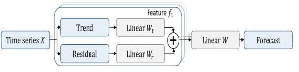
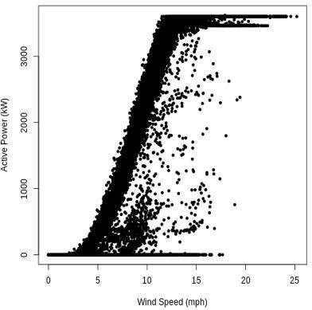
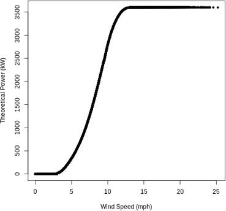
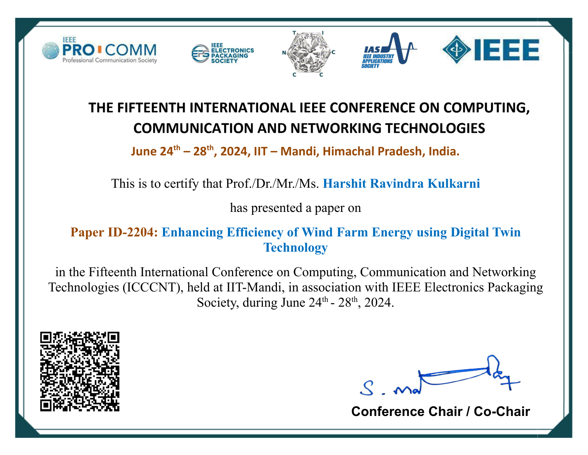

# Enhancing Efficiency of Wind Farm Energy using Digital Twin Technology


[](https://doi.org/10.1109/ICCCNT61001.2024.10724122)

**Authors:** Jesline Daniel, Sugam Bhardwaj, Harshit Ravindra Kulkarni, Habibur Rahman, Sanchi Mahajan, Shikhar Agrawal  
**Affiliation:** Department of Computing Technologies, School of Computing, SRM Institute of Science and Technology, Kattankulathur, India  
**Conference:** 15th ICCCNT IEEE Conference, IIT Mandi (June 24–28, 2024)  
**DOI:** 10.1109/ICCCNT61001.2024.10724122

---

## Overview
This work presents a digital twin-based framework for wind farm monitoring and maintenance. A virtual replica of the wind farm is continuously updated using real-time sensor data, enabling performance evaluation, predictive maintenance, fault detection, and energy optimization. The approach improves reliability, reduces downtime, and supports more sustainable wind energy production.

## Keywords
- Time-series
- Wind power forecasting
- Digital Twin

## Core Contributions
- Real-time digital twin of turbines and farm infrastructure
- Predictive maintenance scheduling using historical and live sensor data
- Fault detection via probabilistic digital twin outputs (UPDT)
- Energy optimization under changing environmental conditions
- Improved sustainability and reduced operational impact

## Methodology
### Digital Twin Implementation
- Virtual replicas of turbines, infrastructure, and environmental conditions are updated in real time.
- Sensor integration captures wind speed, vibration, temperature, pressure, and operational states.
- Historical maintenance and performance logs are used for model training and validation.

### Forecasting Models
- **MDLinear:** Extension of DLinear that decomposes time-series into trend and residual components, forecasting each with linear networks before recombining.
- **XTGN (Extreme Temporal Gated Network):** Uses a Temporal Convolutional Network (TCN) with stacked dilated causal convolutions to capture long-range patterns and handle abrupt wind power fluctuations.

### Predictive Maintenance & Fault Detection
- Probabilistic digital twin (UPDT) assesses turbine health using sensor data.
- Anomalies are flagged when model outputs fall outside the learned probability distribution.

### Operations Simulation
- The digital twin enables scenario-based simulations to identify efficiency improvements and optimize energy output.

## Results & Visuals
**Breakdown of MDLinear method**



**Theoretical Power vs Wind Power**



**Active Power vs Wind Speed**



## Future Work
- More advanced predictive maintenance models for early failure identification
- Edge computing for low-latency, on-site analytics
- Stronger cybersecurity measures for secure data exchange

## Publication Certificate



## Repository Contents
- [Enhancing_Efficiency_of_Wind_Farm_Energy_using_Digital_Twin_Technology.pdf](Enhancing_Efficiency_of_Wind_Farm_Energy_using_Digital_Twin_Technology.pdf)
- [IEEE PUBLICATION CERTIFICATE.pdf](IEEE%20PUBLICATION%20CERTIFICATE.pdf)

## Citation
```bibtex
@inproceedings{daniel2024enhancing,
  title={Enhancing Efficiency of Wind Farm Energy using Digital Twin Technology},
  author={Daniel, Jesline and Bhardwaj, Sugam and Kulkarni, Harshit Ravindra and Rahman, Habibur and Mahajan, Sanchi and Agrawal, Shikhar},
  booktitle={2024 15th International Conference on Computing Communication and Networking Technologies (ICCCNT)},
  year={2024},
  address={IIT Mandi, Kamand, India},
  doi={10.1109/ICCCNT61001.2024.10724122},
  publisher={IEEE}
}
```
